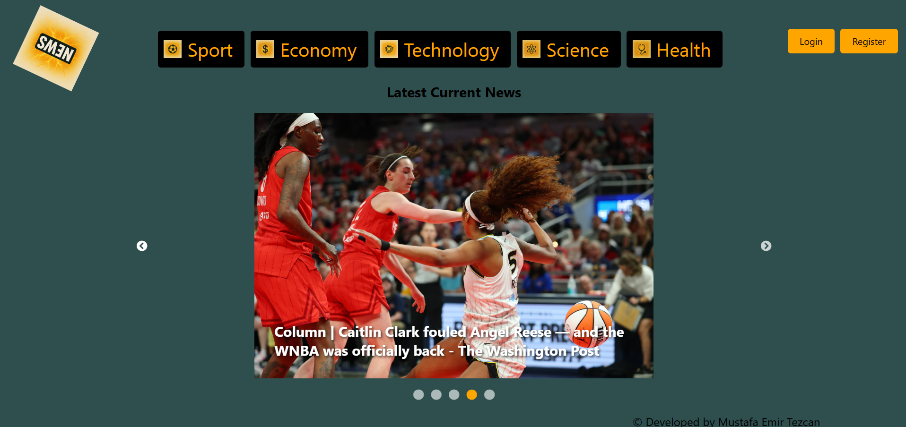
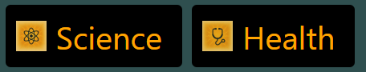
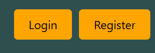
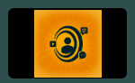
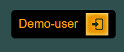
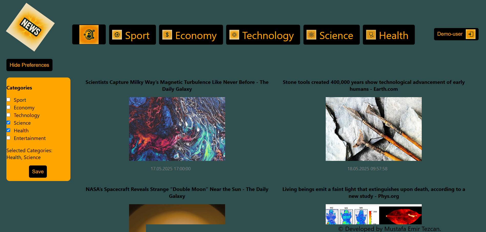

# Personalized News Web App
This is a customizable news feed web application. Users can personalize their news portal based on their interests. Additionally, news articles are categorized into prominent sections such as Technology and Health, and the latest news is made publicly accessible.

The application integrates the News API as its news source. The frontend is developed using React, while the backend is built with Node.js. MongoDB is used as the user database. User registration, authentication, and API integrations are implemented .

This web application features a clean and modern interface and offers a user-friendly experience with a focus on user interaction.

## Project User Guide 
### Getting Started
To run the web application locally, you will need:
- A **MongoDB** account with a valid **database connection URL** [MongoDB](https://www.mongodb.com/)
- An **API key** from [News API](https://newsapi.org/)

These credentials should be added to the `.env` file created in the `backend/` directory. Make sure to define the necessary variables as follows:

```env
API_KEY_1=your_newsapi_key
API_URL_1=your_mongodb_connection_string
JWT_KEY=your_jwt_secret_key (random strong key)
PORT=your_preferred_port_number  # e.g., 3000 (preferably 3005)
```
> Note: Don't forget to change the <db_password> part in the MongoDB URL with your MongoDB password on the database section of website.
### Running the Application
#### 1. Start the Backend (Node.js)
Navigate to the `backend` directory, install the dependencies, and start the server:
```bash
cd backend
npm install
npm start
```
#### 2. Start the Frontend (React)
Navigate to the `frontend` directory, install the required dependencies, and start the user interface:
```bash
cd frontend
npm install
npm start
```
#### 3. Access the Application
Once the frontend is started, your default browser should open automatically. If not, you can manually access the application by visiting:
```
http://localhost:3000
```
> Note: The port value can exceed 3000 (e.g., 3001, 3002) depending on port availability. After running the frontend, you can check the terminal output to determine the assigned port value.

### How to Use?
   #### 1. You can access the homepage, view trending and category-based news (e.g., Science, Health), and click news cards to visit full articles - all **without logging in**.


#### 2. Clicking the **360 degree animated app logo** at the top-left corner of any page will navigate you back to the homepage.  

#### 3. If you are not logged in, you can register or log in using the **Login** and **Register** buttons available on every page.  
   > Note: **Usernames must be unique** during registration.  

#### 4. Once logged in, a new button will appear: **"Personalized News Feed Portal"**.  
   Clicking this will take you to your customizable news portal.  

#### 5. To log out, click the log out button displaying your username located in the top-right corner of the screen.


#### 6. In the Personalized News Feed page, you can:
   - Click the **"Show Preferences"** button to select your preferred news categories.
   - View personalized news based on selected preferences.
   - Click the **"Save"** button to store your preferences in the database for future visits.  
  


